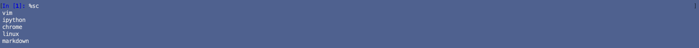
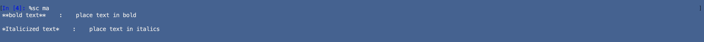
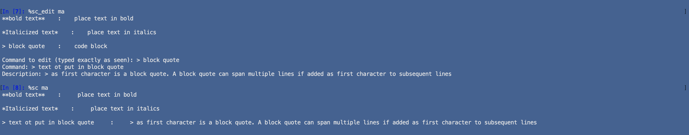
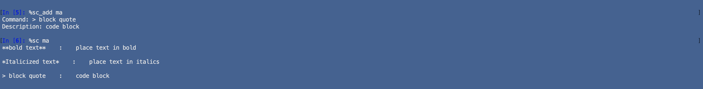

# ShortMagic

### **An IPyhon extension for viewing, creating and editing command references.**

Shortcut files marked with extension '.sct' are plaintext files appended to in IPython using magic method syntax. When called with an argument - a partial name of an application noted in the "APPLICATIONS" enviroment variable - one can add, view and edit command references.

